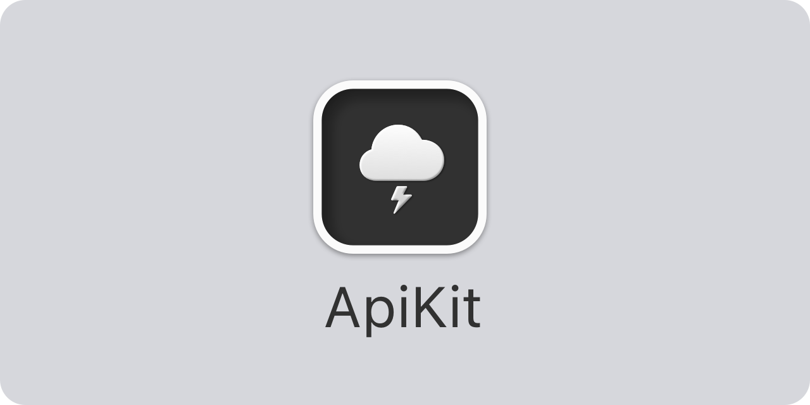

<p align="center">
    
</p>

<p align="center">
    
    
    
    <a href="https://twitter.com/danielsaidi"></a>
    <a href="https://mastodon.social/@danielsaidi"></a>
</p>


## About ApiKit

ApiKit is a Swift SDK that helps you integrate with any REST API.

ApiKit defines an ``ApiClient`` protocol that describes how to request raw and typed data from any REST-based API. This protocol is implemented by ``Foundation/URLSession``, so you can use the shared session without having to create a custom client.    

ApiKit defines ``ApiEnvironment`` and ``ApiRoute`` protocols that make it easy to model and integrate with any REST-based API, as well as an ``ApiRequest`` that can define a route and response type for even easier use.


## Installation

ApiKit can be installed with the Swift Package Manager:

```
https://github.com/danielsaidi/ApiKit.git
```


## Getting Started

Once you have one or several ``ApiEnvironment`` and ``ApiRoute`` values for the API you want to integrate with, you can easily perform requests with any ``ApiClient`` or ``URLSession``:

```swift
let client = URLSession.shared
let environment = MyEnvironment.production(apiToken: "TOKEN")
let route = MyRoutes.user(id: "abc123") 
let user: ApiUser = try await client.request(at: route, in: environment)
```

The generic, typed functions will automatically map the raw response to the type you requested, and throw any raw errors that occur. There are also non-generic variants that can be used if you want to provide custom error handling.

See the [getting started guide][Getting-Started] for more information on how to define environments and routes.


## Documentation

The [online documentation][Documentation] has more information, articles, code examples, etc.


## Demo Application

The demo app lets you explore the library. To try it out, just open and run the `Demo` project.


## Support my work 

You can [sponsor me][Sponsors] on GitHub Sponsors or [reach out][Email] for paid support, to help support my [open-source projects][OpenSource].

Your support makes it possible for me to put more work into these projects and make them the best they can be.


## Contact

Feel free to reach out if you have questions or want to contribute in any way:

* Website: [danielsaidi.com][Website]
* Mastodon: [@danielsaidi@mastodon.social][Mastodon]
* Twitter: [@danielsaidi][Twitter]
* E-mail: [daniel.saidi@gmail.com][Email]


## License

ApiKit is available under the MIT license. See the [LICENSE][License] file for more info.


[Email]: mailto:daniel.saidi@gmail.com

[Website]: https://danielsaidi.com
[GitHub]: https://github.com/danielsaidi
[Twitter]: https://twitter.com/danielsaidi
[Mastodon]: https://mastodon.social/@danielsaidi
[OpenSource]: https://danielsaidi.com/opensource
[Sponsors]: https://github.com/sponsors/danielsaidi

[Documentation]: https://danielsaidi.github.io/ApiKit
[Getting-Started]: https://danielsaidi.github.io/ApiKit/documentation/apikit/getting-started

[License]: https://github.com/danielsaidi/ApiKit/blob/master/LICENSE
