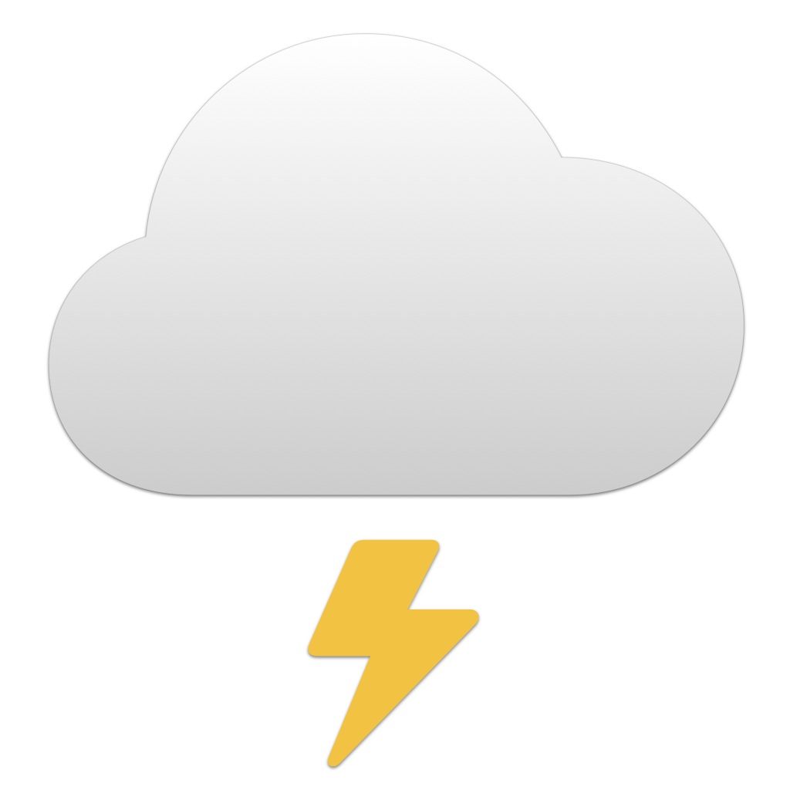

<p align="center">
    
</p>

<p align="center">
    
    
    <a href="https://danielsaidi.github.io/ApiKit"></a>
    <a href="https://github.com/danielsaidi/ApiKit/blob/master/LICENSE"></a>
    <a href="https://github.com/sponsors/danielsaidi"></a>
</p>


# ApiKit

ApiKit is a Swift SDK that helps you integrate with any REST API and automatically map responses to Swift models.

ApiKit defines an ``ApiClient`` protocol that can be used to request raw & typed data from any REST API, as well as ``ApiEnvironment`` and ``ApiRoute`` protocols that make it easy to model environments and routes 

The ``ApiClient`` protocol is already implemented by ``URLSession``, so you can use ``URLSession.shared`` directly.


## Installation

ApiKit can be installed with the Swift Package Manager:

```
https://github.com/danielsaidi/ApiKit.git
```


## Support My Work

By [becoming a sponsor][Sponsors], you directly support the development & improvement of my various [open-source projects][OpenSource]. 

Every sponsor makes a real difference. Thank you for considering [supporting my work][Sponsors]!


## Getting Started

Consider that you want to integrate with the Yelp API, which can return restaurants, reviews, etc.

You would first define the various API environments that you want to integrate with. In this case, let's just integrate with the `v3` environment, which requires an API header token for all requests:

```swift
import ApiKit

enum YelpEnvironment: ApiEnvironment {

    case v3(apiToken: String)
    
    var url: String {
        switch self {
        case .v3: "https://api.yelp.com/v3/"
        }
    }
 
    var headers: [String: String]? {
        switch self {
        case .v3(let token): ["Authorization": "Bearer \(token)"]
        }
    }
}
```

We can then define the routes to request from the Yelp API. In this case, let's just fetch a business by unique ID:

```swift
import ApiKit

enum YelpRoute: ApiRoute {

    case business(id: String)

    var path: String {
        switch self {
        case .business(let id): "businesses/\(id)"
        }
    }

    var httpMethod: HttpMethod { .get }
    var headers: [String: String]? { nil }
    var formParams: [String: String]? { nil }
    var postData: Data? { nil }
    
    var queryParams: [String: String]? {
        switch self {
        case .business: nil
        }
    }
}
``` 

With an environment and route in place, we can now fetch a `YelpBusiness` with any ``ApiClient`` or ``URLSession``:

```swift
let client = URLSession.shared
let environment = YelpEnvironment.v3(apiToken: "YOUR_TOKEN")
let route = YelpRoute.business(id: "abc123") 
let business: YelpBusiness = try await client.request(route, in: environment)
```

The generic request functions will automatically map the raw response to the requested type, and throw any error that occurs. There are also non-generic variants if you want to get the raw data or use custom error handling.

See the online [getting started guide][Getting-Started] for more information.


## Documentation

The online [documentation][Documentation] has more information, articles, code examples, etc.


## Demo Application

The `Demo` folder has a demo app that lets you explore the library and integrate with a few APIs.


## Contact

Feel free to reach out if you have questions, or want to contribute in any way:

* Website: [danielsaidi.com][Website]
* E-mail: [daniel.saidi@gmail.com][Email]
* Bluesky: [@danielsaidi@bsky.social][Bluesky]
* Mastodon: [@danielsaidi@mastodon.social][Mastodon]


## License

ApiKit is available under the MIT license. See the [LICENSE][License] file for more info.


[Email]: mailto:daniel.saidi@gmail.com
[Website]: https://danielsaidi.com
[GitHub]: https://github.com/danielsaidi
[OpenSource]: https://danielsaidi.com/opensource
[Sponsors]: https://github.com/sponsors/danielsaidi

[Bluesky]: https://bsky.app/profile/danielsaidi.bsky.social
[Mastodon]: https://mastodon.social/@danielsaidi
[Twitter]: https://twitter.com/danielsaidi

[Documentation]: https://danielsaidi.github.io/ApiKit
[Getting-Started]: https://danielsaidi.github.io/ApiKit/documentation/apikit/getting-started
[License]: https://github.com/danielsaidi/ApiKit/blob/master/LICENSE
